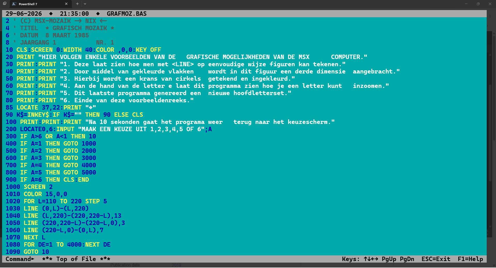

# MSXEdit

<figure>
  
  <figcaption>Banner do MSXEdit</figcaption>
</figure>

MSXEdit é um editor TUI com estética retrô, pensado para desenvolvimento em plataformas clássicas como MSX, mas executado em terminais modernos no Windows e Linux.

O projeto combina uma base visual inspirada em Turbo Vision, Norton Editor e ferramentas Borland com uma arquitetura Go moderna, priorizando janelas customizadas, temas VGA explícitos e navegação por teclado/mouse.

## Release atual

- **Versão**: `4.1.9`
- **Build ID**: gerado dinamicamente em hexadecimal UTC durante a execução/build.

## Novidades da 4.1.9

- **Múltiplas janelas de edição**: `File → New` cria janelas em cascata a partir da ativa;
  `Alt+F3` fecha a janela ativa sem encerrar o programa (o desktop fica visível para `New`/`Open`).
- **Menu `Edit` funcional**: `Undo`/`Redo`, `Cut`/`Copy`/`Paste`/`Clear` e `Show clipboard` — um
  clipboard agora é compartilhado entre todas as janelas de edição, com janela dedicada para
  visualizá-lo/editá-lo.
- **Menu `Search` funcional**: diálogos `Find...`, `Replace...` e `Go to line number...`, mais
  `Search again` (`Ctrl+L`). O `Find` já busca de verdade (case sensitive, whole words, regex,
  direção, escopo); o `Replace` captura as mesmas opções mas ainda não substitui o texto.
- **Seleção de texto** com `Shift`+navegação ou arraste do mouse, reaproveitando os comandos de
  bloco/clipboard existentes.
- **Atalhos de edição estilo WordStar/Turbo**: movimentação de cursor (`Ctrl+S/D/A/F/E/X/W/Z/R/C`),
  modo Insert/Overwrite (`Ins`/`Ctrl+V`), inserir/remover linha (`Ctrl+N`/`Ctrl+Y`), apagar até o
  fim da linha (`Ctrl+Q Y`), apagar palavra à direita (`Ctrl+T`), place markers (`Ctrl+K`/`Ctrl+Q`
  `0-9`), restore line (`Ctrl+Q L`), tab mode e auto indent (`Ctrl+O T`/`Ctrl+O I`) e o prefixo
  `Ctrl+P` para inserir códigos de controle literais.
- Novos tópicos reais de `Help`: **Cursor-movement commands**, **Insert & Delete commands** e
  **Miscelaneous commands**, com título em botão 3D como o já existente `Block commands`.

## O que já está implementado

- **Janela de edição retrô no startup**: a aplicação abre automaticamente a primeira janela de edição, com moldura dupla, botão `[■]`, título centralizado, identificador numérico e barras de rolagem desenhadas manualmente.
- **Múltiplas janelas de edição**: `File → New` cria janelas adicionais em cascata, cada uma com
  clipboard compartilhado e ID próprio; `Alt+F3` ou `[■]` fecham a janela ativa sem encerrar o
  programa.
- **Desktop quadriculado estilo DOS**: o fundo da aplicação usa renderização dedicada com padrão VGA clássico.
- **Barra de menus Turbo-like**: menus superiores com navegação por `Alt+Letra`, `F10`, setas, `Enter` e clique do mouse.
- **Estrutura atual de menus**:
  - Ativos: `File` (New, Open F3, Exit), `Edit` (Undo/Redo, Cut/Copy/Paste/Clear, Show clipboard),
    `Search` (Find, Replace, Search again, Go to line number), `Options` (Compiler/Interpreter…),
    `Help` (Contents, About)
  - Estruturais / placeholder visual: `Run`, `Compile`, `Debug`, `Tools`, `Window`
- **Edição estilo WordStar/Turbo**: comandos de cursor, seleção com Shift/mouse, place markers,
  restore line, tab mode, auto indent, modo Insert/Overwrite e o prefixo `Ctrl+P` para códigos de
  controle literais — veja [`MANUAL.md`](MANUAL.md) para a lista completa de atalhos.
- **Busca e navegação por linha**: diálogos `Find`, `Replace` e `Go to line number` (texto ou
  número de linha do MSX-Basic), com histórico compartilhado entre eles.
- **Diálogo Open File (F3)**:
  - Ativado por `F3` globalmente ou pelo menu `File → Open… F3`
  - Campo `&Name` com fundo azul escuro e seta `↓` verde para histórico de máscaras
  - Lista `&Files` bicolunar em ciano, sem moldura, com separador de diretórios
  - Barra de rolagem horizontal em azul com controles `◄▒■►`
  - Área de status completa: caminho+máscara na linha 1; nome, tipo, data, hora e tamanho na linha 2
  - Quatro botões Turbo Vision: `Open`, `Replace`, `Cancel`, `Help` — todos com largura 11
- **Sistema de Help navegável**:
  - carregamento automático do arquivo externo [`HELP.md`](HELP.md)
  - fallback para tópicos internos quando o markdown não estiver disponível
  - links entre tópicos, breadcrumb de navegação
  - retorno por `Alt+F1` (com fallback `Alt+Q`)
  - suporte a teclado e mouse
- **Diálogos reutilizáveis**: componente `dialogoOK` com centralização automática, botão configurável e fechamento por teclado/mouse.
- **Botões estilo Turbo Vision**: componente `turboButton` com hotkey destacada e modos de sombra `shadowModeTurboClassic` e `shadowModeFlat`.
- **Diálogo de opções do compilador/interpretador**: janela `Compiler/Interpreter Options` com 9 radio buttons, 3 checkboxes com marcador em bolinha, área `Conditional defines:` e botões `OK`/`Cancel`/`Help`.
- **Syntax highlighting MSX-BASIC** no editor: mais de 100 keywords, 11 categorias de token, números em todas as bases, zonas literais `REM`/`DATA`/`string`/apóstrofo.
- **Windowing flutuante**: arrastar pela barra de título, redimensionar pelo canto `◢`, maximizar/restaurar com `[▲]`/`[▼]`, scrollbars clicáveis.
- **Tema VGA padronizado**:
  - `default`: Borland blue / MS-DOS clássico
  - `blue`: NC-style / Norton Commander, com menu e status em ciano
- **CLI e configuração persistente**:
  - `--theme`, `--tabsize`, `--no-highlight`, `--local`, `--version`
- **Build automatizado**: script [`build.ps1`](build.ps1) extrai a versão automaticamente de `cmd/msxedit/main.go`, gera `Build ID` e compila para Windows ou Linux.

## Estado atual do projeto

### Em funcionamento hoje

- edição de texto em `TextArea`, com múltiplas janelas simultâneas
- janelas e diálogos customizados
- menu superior com dropdown, incluindo `Edit` e `Search` funcionais
- diálogo Open File (F3) — navegação de arquivos e diretórios
- diálogos `Find`, `Replace` (busca) e `Go to line number`
- clipboard compartilhado entre janelas, com janela `Show clipboard`
- seleção de texto por teclado (Shift) e mouse
- atalhos de edição estilo WordStar/Turbo (cursor, markers, tab mode, auto indent, overwrite)
- janela de `Help`
- `About`
- temas e configuração base
- suporte a mouse em áreas principais da UI

### Em evolução / ainda não finalizado

- leitura efetiva do arquivo selecionado no diálogo Open (integração com editor)
- substituição efetiva de texto no diálogo `Replace` (opções e histórico já funcionam)
- fluxo completo de `Save`
- ações reais de `Compile` / `Make`
- renderização de números de linha usando `show_line_numbers`

<figure>
  
  <figcaption>Tela principal do MSXEdit em execução</figcaption>
</figure>

## msxread — visualizador companheiro

O projeto inclui um segundo executável, **`msxread`**, um visualizador de textos no espírito do
leitor de `README` do Turbo Pascal. Funciona de forma independente do `msxedit`.

<figure>
  
  <figcaption>MSX-Read em execução</figcaption>
</figure>

- **Tipos suportados**: `.txt` (texto puro), `.bas` **tokenizado** (detokenizado para listagem
  BASIC legível) e `.md` (ajuda, com render leve de títulos e links).
- **Tela de ajuda (F1)**: overlay com cabeçalho "Welcome to MSX-Read v:(versão)" centralizado,
  copyright Cybernostra e lista completa de atalhos.
- **Layout**: barra de topo cinza (data `◆` hora `◆` nome do arquivo), corpo com fundo cyan e
  barra de status `Command►` com indicador de posição (`*** Top of File ***`) e mini-help de teclas.
- **Navegação**: setas, `PgUp`/`PgDn`, `Home`/`End`, roda do mouse, `F1` (ajuda) e `ESC` (sair).
- **Busca**: `F` inicia, digitar filtra em tempo real, `N` próxima ocorrência, `C` case-sensitive.
- **Cores**: `F5`/`F6` cor do texto, `F7`/`F8` cor do fundo — 16 cores VGA.
- **CLI** (via `cobra`):

```powershell
.\msxread.exe MANUAL.md
.\msxread.exe programa.bas
.\msxread.exe --type txt arquivo.dat
.\msxread.exe --version
```

O detokenizador MSX-BASIC vive em `internal/basic` e segue a referência de [`TOKEN.md`](TOKEN.md).

## Stack do projeto

- **Go 1.26+**
- **tview** e **tcell**
- **PowerShell** para automação de build
- **GPL 3.0**

## Documentação

- [`MANUAL.md`](MANUAL.md): compilação, operação, atalhos e limitações atuais
- [`REFERENCE.md`](REFERENCE.md): opções de CLI, configuração e comportamento da UI
- [`HELP.md`](HELP.md): conteúdo do sistema de ajuda carregado em runtime
- [`OUTLINE.md`](OUTLINE.md): histórico conceitual e decisões de arquitetura
- [`TOKEN.md`](TOKEN.md): referência do formato binário MSX-BASIC
