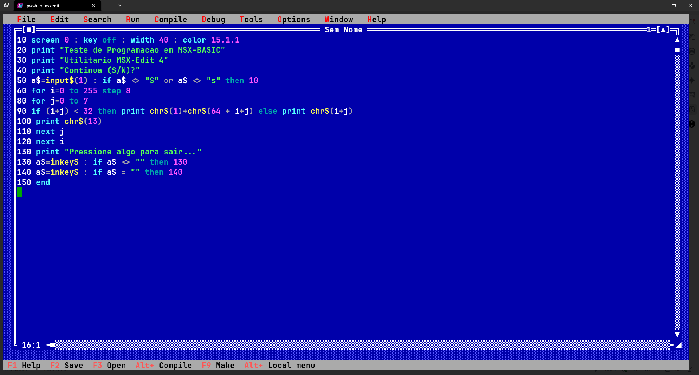
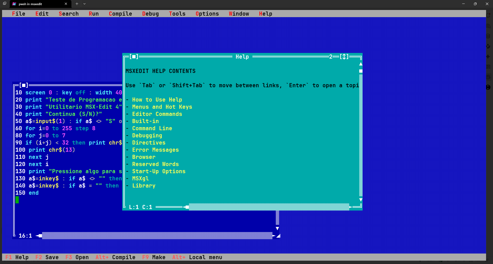

# MSXEdit

<figure>
  
  <figcaption>Banner do MSXEdit</figcaption>
</figure>

MSXEdit é um editor TUI com estética retrô, pensado para desenvolvimento em plataformas clássicas como MSX, mas executado em terminais modernos no Windows e Linux.

O projeto combina uma base visual inspirada em Turbo Vision, Norton Editor e ferramentas Borland com uma arquitetura Go moderna, priorizando janelas customizadas, temas VGA explícitos e navegação por teclado/mouse.

## Release atual

- **Versão**: `4.0.7`
- **Build ID**: gerado dinamicamente em hexadecimal UTC durante a execução/build.

## Novidades da 4.0.7

- Janela de `Help` consolidada com carregamento de `HELP.md`, links navegáveis, breadcrumb e fallback interno.
- Navegação expandida por teclado e mouse (menus superiores, links do `Help`, rolagem e fechamento por `[■]`).
- Componentes visuais reutilizáveis (`dialogoOK` e `turboButton`) padronizados para o estilo Turbo Vision.
- Documentação revisada para separar claramente recursos já entregues dos itens ainda em evolução.

## O que já está implementado

- **Janela de edição retrô no startup**: a aplicação abre automaticamente a primeira janela de edição, com moldura dupla, botão `[■]`, título centralizado, identificador numérico e barras de rolagem desenhadas manualmente.
- **Desktop quadriculado estilo DOS**: o fundo da aplicação usa renderização dedicada com padrão VGA clássico.
- **Barra de menus Turbo-like**: menus superiores com navegação por `Alt+Letra`, `F10`, setas, `Enter` e clique do mouse.
- **Estrutura atual de menus**:
  - Ativos: `File`, `Help`
  - Estruturais / placeholder visual: `Edit`, `Search`, `Run`, `Compile`, `Debug`, `Tools`, `Options`, `Window`
- **Sistema de Help navegável**:
  - carregamento automático do arquivo externo [`HELP.md`](HELP.md)
  - fallback para tópicos internos quando o markdown não estiver disponível
  - links entre tópicos
  - breadcrumb de navegação
  - retorno por `Alt+F1` (com fallback `Alt+Q`)
  - suporte a teclado e mouse
- **Diálogos reutilizáveis**: componente `dialogoOK` com centralização automática, botão configurável e fechamento por teclado/mouse.
- **Botões estilo Turbo Vision**: componente `turboButton` com hotkey destacada e modos de sombra `shadowModeTurboClassic` e `shadowModeFlat`.
- **Diálogo de opções do compilador/interpretador**: janela `Compiler/Interpreter Options` com 9 radio buttons, 3 checkboxes com marcador em bolinha, área `Conditional defines:` e botões `OK`/`Cancel`/`Help`.
- **Tema VGA padronizado**:
  - `default`: Borland blue / MS-DOS clássico
  - `blue`: NC-style / Norton Commander, com menu e status em ciano
- **CLI e configuração persistente**:
  - `--theme`
  - `--tabsize`
  - `--no-highlight`
  - `--local`
  - `--version`
- **Build automatizado**: script [`build.ps1`](build.ps1) extrai a versão automaticamente de `cmd/msxedit/main.go`, gera `Build ID` e compila para Windows ou Linux.

## Estado atual do projeto

O foco das últimas iterações foi consolidar a base visual e a infraestrutura de navegação da aplicação. Por isso, a documentação agora diferencia com clareza o que já está pronto do que ainda está em evolução.

### Em funcionamento hoje

- edição de texto em `TextArea`
- janelas e diálogos customizados
- menu superior com dropdown
- janela de `Help`
- `About`
- temas e configuração base
- suporte a mouse em áreas principais da UI

### Em evolução / ainda não finalizado

- fluxo completo de `Open` / `Save`
- ações reais de `Compile` / `Make`
- `syntax highlighting` efetivo no editor
- parser de arquivos BASIC tokenizados (`.BAS` binário)
- renderização de números de linha usando `show_line_numbers`

<figure>
  
  <figcaption>Tela principal do MSXEdit em execução</figcaption>
</figure>

## Stack do projeto

- **Go 1.26+**
- **tview** e **tcell**
- **PowerShell** para automação de build
- **GPL 3.0**

## Documentação

- [`MANUAL.md`](MANUAL.md): compilação, operação, atalhos e limitações atuais
- [`REFERENCE.md`](REFERENCE.md): opções de CLI, configuração e comportamento da UI
- [`HELP.md`](HELP.md): conteúdo do sistema de ajuda carregado em runtime
- [`OUTLINE.md`](OUTLINE.md): histórico conceitual e decisões de arquitetura
